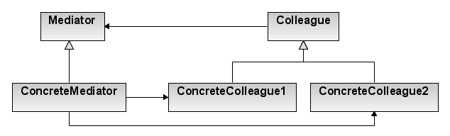

# Mediator

## Finalidad

* Nos permite definir un objeto que encapsula cómo un conjunto de objetos interactúan
* Promueve el bajo acoplamiento, evitando que los objetos se llamen explícitamente entre sí y permite variar su interacción de forma independiente
* Minimiza la complejidad de la gestión de dependencia y comunicación entre los participantes
* Facilitar la interacción entre objetos, haciendo que los objetos no conozcan la existencia de otros objetos: los objetos dependen únicamente de un
  único mediador, en lugar de acoplarse entre ellos
* Esto nos permite extraer las relaciones entre clases en una clase separada, aislando cualquier cambio que un objeto pueda tener

## ¿Cuándo usarlo?

* Cuando necesitemos disminuir el acoplamiento que hay en la comunicación entre objetos

