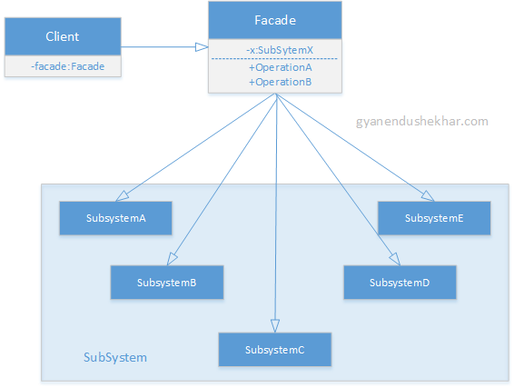

# Proxy

## Finalidad

* Proporcionar una interface unificada para un conjunto de interfaces de un subsistema.
* Define una interface de orden superior, con la finalidad de que el uso del subsistema sea lo más sencillo posible
* Desacopla el cliente de un subsistema complejo

## ¿Cuándo usarlo?

* Cuando necesitemos simplificar y unificar una interface grande o un conjunto de ellas

